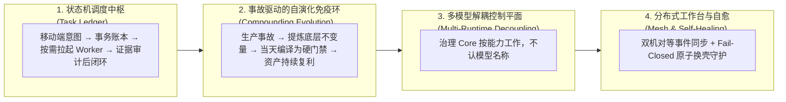

# 🏛️ Agent Operations Fabric
### The Autonomous Agent Operations & Governance Control Plane
*面向业务决策者、AI 原生组织与超级个体的生产级智能体治理底座*

> **“让超级组织拥有确定性的制度密度；让 AI Agent 运行在物理级的自愈底盘之上。”**
> **Institutional-grade governance for autonomous organizations, grounded on a deterministic, self-healing control plane.**

[](LICENSE)
[](.github/workflows/ci.yml)
[](docs/03_governance_architecture.md)

本仓是一套自 2026 年 3 月起持续运行的个人／小团队 Agent 治理系统的**脱敏提炼**：
`docs/` 是方法论，`core/` 是可直接运行的参考机制，`tests/` 是这些机制**拒绝**了什么的证明。

---

## 💡 为什么需要 Agent Operations Fabric？

把复杂工程、财务对账与自动化运营交给 AI Agent，实践中会撞上四类系统性瓶颈：

1. ❌ **Prompt 越写越长，会话越来越卡**：十几页 SOP 塞进提示词，对话一拉长 Agent 依然遗忘，换个模型版本直接失效；
2. ❌ **口头承诺"已搞定"，暗病防不胜防**：Agent 在聊天框里信心满满，实际没跑全量测试，甚至静默覆盖了重要文件；
3. ❌ **多 Agent 协作踩烂仓库**：并行会话同时改分支，未暂存文件互相裹挟，Git 历史被踩烂；
4. ❌ **移动端无法安心派单**：在外面用手机让电脑干活，不是怕它瞎删数据，就是进程断连静默死掉。

**第一性原理：**
**把规矩留在 Prompt 文本里是负债（AI 会忘，还要你买单）；把规矩编译成物理门禁与状态机才是资产（违反即阻断，0 Token 消耗，换任何模型照样生效）。**

---

## 💎 核心四大支柱 (The 4 Pillars)



### 1. 事务状态机调度中枢（Task Ledger）
- **总机接线不干重活**：常驻总机只做接线与意图拆解，代码任务按需临时拉起子 Worker，完工即销毁，总机上下文增长极慢。
- **完工凭据不可伪造**：Worker 无权关闭自己的任务——`receive_result` 只记录它的主张，状态停在 `result_received`。关单是调度器的独立动作，且**必须提交通过契约校验的证据**（commit ref + 测试退出码）。空证据、红色测试、不存在的任务 id，全部当场拒绝并保持任务开启。

### 2. 事故驱动的自演化免疫系统（Incident-Driven Compounding Loop）
- **把文本负债编译为机制资产**：每次踩坑当天反演为底层不变量，在同一个 Session 内编译成 Hook 与 Git 门禁。
- **断言不变量，不列黑名单**：黑名单式门禁在换一个载体违反同一不变量时必被击穿，`docs/02` 元规则一。
- **门禁必须证明自己拒绝了什么**：`ops/check_negative_test_coverage.py` 断言 `core/` 每个模块都带负向测试。只走顺路的测试套件，无论拒绝逻辑是否有效都会全绿——这个仓库亲历过这件事，见 `docs/04` 案例 9。

### 3. 多模型解耦控制平面（Multi-Runtime Core Decoupling）
- **能力驱动而非名称驱动**：Core 只按能力标准与标准 I/O 工作，全仓不出现任何厂商名或模型名。
- **热插拔适配**：运行时差异（命令行参数、hook schema、session 路径）全部收在显式 adapter 层。

### 4. 分布式工作台与自愈（Mesh Topology & Fail-Closed Rotation）
- **双机对等 Canonical 架构**：Git bare 扇出 + post-receive 事件钩子，两台工作站实时双向同步。
- **Fail-Closed 原子换壳**：转录超阈值时冷起影子会话，**影子必须先在真实消息通道上应答**，之后才轮到旧会话退役。任一步失败即销毁影子、旧会话继续服务——任何时刻服务方数量都不为零。

---

## 🥊 心智模型对比：玩具级 Agent vs 治理控制平面

| 维度 | 传统玩具级 Agent（Prompt-Centric） | Agent Operations Fabric（Governance-Centric） |
|---|---|---|
| **核心介质** | Prompt 软法（越堆越臃肿，模型一换即失效） | **确定性机制**（门禁、状态机、Hook，0 上下文开销） |
| **任务闭环** | 相信 Agent 口头汇报的"已搞定" | **状态机账本 + 证据契约校验**（空证据关不了单） |
| **测试** | 证明"命令能跑通" | **先证明它拒绝了什么**，由门禁强制 |
| **长驻运维** | 几小时 Context 撑爆，断网静默掉线 | **接线不干活 + Fail-Closed 换壳与死窗精准上报** |
| **多模型支持** | 每个模型单独手写一套 Prompt | **一套 Core 统摄全异构运行时** |
| **人机分工** | 人类当保姆，反复在对话框纠偏 | **人类当立法者，AI 当编译器，物理环境当积累介质** |

---

## 📂 仓库目录索引

- [`docs/`](docs/)：架构规范白皮书与教学大纲
  - [`01_master_thesis.md`](docs/01_master_thesis.md)：主命题——AI 时代制度化成本塌缩
  - [`02_minimal_kernel.md`](docs/02_minimal_kernel.md)：最小内核——四基本法、复利飞轮、三文件起步
  - [`03_governance_architecture.md`](docs/03_governance_architecture.md)：分层契约（L1/L2/L3）与自愈拓扑
  - [`04_incident_casebook.md`](docs/04_incident_casebook.md)：9 则真实脱敏生产事故复盘
  - [`05_curriculum.md`](docs/05_curriculum.md)：7 讲实战教学与演讲大纲
- [`core/`](core/)：4 个可运行的参考机制。**每个模块都在自己的 docstring 里写明了它不覆盖什么**——一道被误以为覆盖更广的门禁，比没有门禁更危险。
  - [`task_ledger.py`](core/task_ledger.py)：任务事务状态机 + 完工证据契约
  - [`switchboard_supervisor.py`](core/switchboard_supervisor.py)：容量测量 + Fail-Closed 原子换壳与回滚
  - [`pre_tool_use_safety.sh`](core/pre_tool_use_safety.sh)：命令位判定式破坏性操作拦截
  - [`check_commit_standalone.py`](core/check_commit_standalone.py)：提交树自洽性门禁（解析真实依赖引用，非字面扫描）
- [`tests/`](tests/)：每个机制一套测试，**负向用例在前**
- [`ops/`](ops/)：仓库门禁，本地与 CI 跑同一套

---

## 🚀 新手第零天：从 3 个文件起步

不需要立刻部署全家桶。今天就可以在项目根目录创建 3 个文件：

1. **宪法（`RULES.md`）**：人机协作的顶层不可逾越红线（≤ 10 条）；
2. **事故簿（`INCIDENTS.md`）**：四要素——发生了什么 / 底层不变量 / 编译成的机制 / 怎么验证它活着；
3. **收尾清单（`CLOSEOUT.md`）**：退出会话前的核对单（路径、证据、未决事项）。

当事故簿里重复出现的问题被编译成 `core/` 里的门禁脚本，你的系统就长出了自己的免疫体系。

---

## ✅ 本地验证

```bash
python3 -m unittest discover tests/          # 全量测试
./ops/check_release_governance_consistency.sh  # 治理一致性 + 隐私泄漏扫描
./ops/check_negative_test_coverage.py          # 每个机制是否证明了自己的拒绝
./ops/enforce_agent_onboarding_gate.sh         # 上面三道的组合入口
```

贡献规范见 [`CONTRIBUTING.md`](CONTRIBUTING.md)。

---

## 📄 License & Attribution
本项目采用 [Apache 2.0 License](LICENSE) 开源发布。欢迎引用、演化与参考实战范式。
