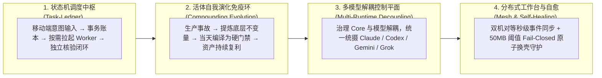

# 🏛️ Agent Operations Fabric
### The Autonomous Agent Operations & Governance Control Plane
*面向业务决策者、AI 原生组织与超级个体的生产级智能体治理底座*

> **“让超级组织拥有确定性的制度密度；让 AI Agent 运行在物理级的自愈底盘之上。”**  
> **Empowering Autonomous Organizations with Institutional-Grade Governance; Grounding AI Agents on a Deterministic, Self-Healing Control Plane.**

---

## 💡 为什么需要 Agent Operations Fabric？

在实际业务生产中，将复杂工程、财务对账与自动化运营交给 AI Agent 往往会撞上四大系统性瓶颈：

1. ❌ **Prompt 越写越长，会话越来越卡**：写了十几页 SOP 放在提示词里，随着对话拉长，Agent 依然频繁遗忘，换个模型版本直接失效；
2. ❌ **口头承诺“已搞定”，暗病防不胜防**：Agent 在聊天框里信心满满，但代码未跑全量测试、甚至静默覆盖重要文件；
3. ❌ **多 Agent 协作踩烂仓库**：多个并行会话同时修改分支，未暂存文件互相裹挟，Git 历史被踩烂；
4. ❌ **移动端无法安心派单**：在外面用手机想随手让电脑干活，不是怕它瞎删数据，就是进程断连静默死掉。

**本系统的第一性原理：**  
**把规矩留在 Prompt 文本里是负债（AI 会忘还要你买单）；把规矩编译成物理门禁与状态机才是资产（物理阻断，0 Token 消耗）。**

---

## 💎 核心四大系统支柱 (The 4 Pillars)

### 1. 事务状态机调度中枢（Task-Ledger & Switchboard）
- **总机接线不干重活**：常驻移动总机坚守接线与意图拆解，代码任务按需临时拉起子 Worker 执行，完工即销毁。总机上下文数月不爆。
- **不可伪造的完工凭据**：Worker 自身无权关单，调度器依据独立的 Commit 证据、测试退出码和落盘文件进行双重审计后方可闭环。

### 2. 事故驱动的自演化免疫系统（Incident-Driven Compounding Loop）
- **把文本负债编译为机制资产**：每次踩坑直接反演为底层不变量，当天在同一个 Session 内编译为 PreToolUse 钩子与 Git 门禁。
- **断言不变量而非黑名单**：直击事故因果链本身，杜绝换个载体再次复发。

### 3. 多模型解耦控制平面（Multi-Runtime Core Decoupling）
- **能力驱动而非名称驱动**：核心治理（状态机、同步契约、安全防线）与具体模型名称彻底解耦。
- **热插拔适配**：无缝混用 Claude Code、Codex、Gemini CLI 等异构运行时，全系统保持一致的治理语义。

### 4. 分布式工作台网状拓扑与自愈（Mesh Topology & Autonomous Healing）
- **双机对等 Canonical 架构**：通过 Git bare 扇出与 post-receive 秒级事件钩子，实现台式机与笔记本之间的实时双向同步与冲突自愈。
- **Fail-Closed 原子换壳看护器**：转录超限时后台冷起新会话接管通信，接管失败自动原地回滚，实现 7×24 小时零人工干预稳定待命。

---

## 🥊 心智模型对比：玩具级 Agent vs 治理控制平面

| 维度 | 传统玩具级 Agent（Prompt-Centric） | Agent Operations Fabric（Governance-Centric） |
|---|---|---|
| **核心介质** | 依靠 Prompt 软法（越堆越臃肿，模型一换即失效） | **编译为确定性机制**（门禁、状态机、Hook，0 上下文开销） |
| **任务闭环** | 相信 Agent 口头汇报的“已搞定” | **状态机账本 + 独立二次验证证据（Evidence Anchor）** |
| **长驻运维** | 几小时 Context 撑爆，断网静默掉线 | **接线不干活 + 50MB 阈值原子换壳与死窗精准捕获** |
| **多模型支持** | 为每个模型单独手写一套 Prompt 和规则 | **多模型解耦控制平面**（一套 Core 规则统摄全异构模型） |
| **人机分工** | 人类充当保姆，反复在对话框里纠偏细节 | **人类当最高立法者，AI 当编译器，物理环境当积累介质** |

---

## 📂 仓库目录索引

- [`docs/`](docs/)：完整的架构规范白皮书与教学大纲
  - [`docs/01_master_thesis.md`](docs/01_master_thesis.md)：主命题——AI 时代制度化成本塌缩
  - [`docs/02_minimal_kernel.md`](docs/02_minimal_kernel.md)：最小内核——三角色、四基本法、三文件起步
  - [`docs/03_governance_architecture.md`](docs/03_governance_architecture.md)：分层契约（L1/L2/L3）与自愈拓扑
  - [`docs/04_incident_casebook.md`](docs/04_incident_casebook.md)：8 则真实脱敏生产事故复盘
  - [`docs/05_curriculum.md`](docs/05_curriculum.md)：7 讲实战教学与演讲大纲
- [`core/`](core/)：4 个生产级脱敏参考实现模块
  - [`core/task_ledger.py`](core/task_ledger.py)：通用任务事务状态机账本
  - [`core/switchboard_supervisor.py`](core/switchboard_supervisor.py)：进程能力探针与 50MB 换壳看护器
  - [`core/pre_tool_use_safety.sh`](core/pre_tool_use_safety.sh)：破坏性操作物理拦截钩子
  - [`core/check_commit_standalone.py`](core/check_commit_standalone.py)：Git 提交树独立自洽性门禁
- [`tests/`](tests/)：核心参考模块的全量自动化测试套件

---

## 🚀 新手第零天：如何从 3 个文件起步？

你不需要立刻部署复杂的全家桶。今天就可以在你的项目根目录创建 3 个文件：

1. **宪法（`RULES.md`）**：定义人与 AI 协作的顶层不可逾越红线（≤ 10 条）；
2. **事故簿（`INCIDENTS.md`）**：记录四要素（发生了什么 / 底层不变量 / 编译成的机制 / 存活验证法）；
3. **收尾清单（`CLOSEOUT.md`）**：退出会话前的退出核对清单（路径、证据、未决事项）。

随着事故簿里重复出现的问题被 AI 编译为 `core/` 目录中的门禁脚本，你的系统将自然长出属于你自己的免疫体系。

---

## 📄 License & Attribution
本项目采用 [Apache 2.0 License](LICENSE) 开源发布。
欢迎引用、演化与参考实战范式。
