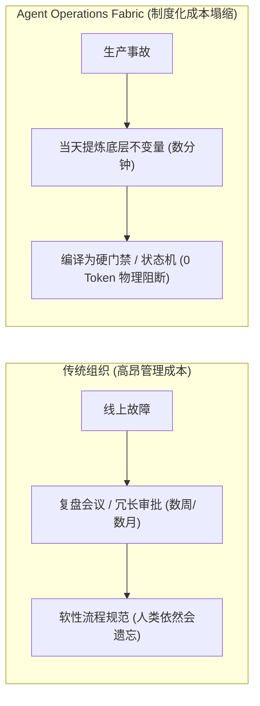
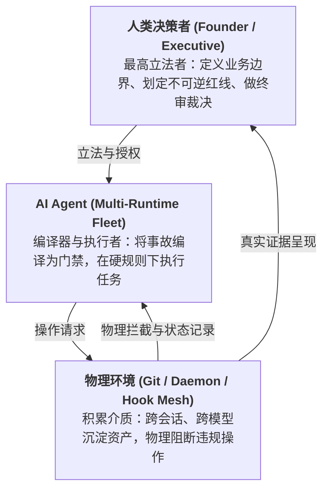

# 第一部分 · 主命题与经济学范式跃迁 (The Master Thesis)

> **“AI 时代，个人与高管第一次在经济上养得起过去只有大型机构才养得起的治理体系。”**

---

## 1. 传统软件工程 vs AI 时代的制度化成本

在传统的组织结构中，流程控制、双重质检、事故反演与安全门禁需要耗费极高的人力与管理成本：
- 执行者是昂贵、有情绪、容易疲劳的人类工程师；
- 每次建立流程规范，需要召开冗长的跨部门委员会；
- 最终，个人和小团队的经验只能停留在“个人记性”与“工作习惯”中，随着时间推移反复丢失、同类事故反复重犯。

而在现代大模型时代，执行者变成了高通量、低边际成本的 AI Agent。
**把每一次犯错在当天、同一个 Session 内编译为确定性机制的成本，从“跨部门委员会的数月论证”塌缩为“几分钟的门禁脚本编写”**。

---

## 2. 核心转换公式：文本是负债，机制是资产

这是整套方法论的核心基石：

- **文本是软法，是系统负债**：
  写在 Prompt、README 或记事本里的规则，Agent 会遗忘、会产生偶发性幻觉、换一个模型版本就会失效，且每条规则都在持续消耗宝贵的上下文（Context Window）预算——规则越多，系统越臃肿。
- **机制是硬法，是确定性资产**：
  编译成 Shell Hook、Git 门禁、守护脚本、状态机账本的规则，**物理上不占上下文、不依赖 Agent 自觉、违反即阻断、换任何模型照样生效**。

### 核心判据
每次面对 AI 踩坑或新流程需求时，必须回答：
> **“这条规则目前是文本还是机制？能不能在系统物理层直接下沉为脚本或门禁？”**  
> 只有真正无法脚本化的模糊意图，才允许暂留在文本层。

---

## 3. 人机分工三角形：立法者、编译器与积累介质

- **人类当最高立法者**：不阅读长串底层代码细节，不人肉背诵流程细节，专注于业务输入与红线定义；
- **AI 当编译器与执行者**：利用大模型强大的代码编写与逻辑提炼能力，充当从“事故经验”到“门禁脚本”的编译器；
- **环境当物理积累介质**：利用 Git、操作系统守护进程（launchd/systemd）、Hook 机制确保所有沉淀跨会话永久生效。
