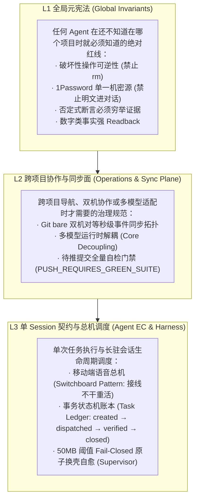
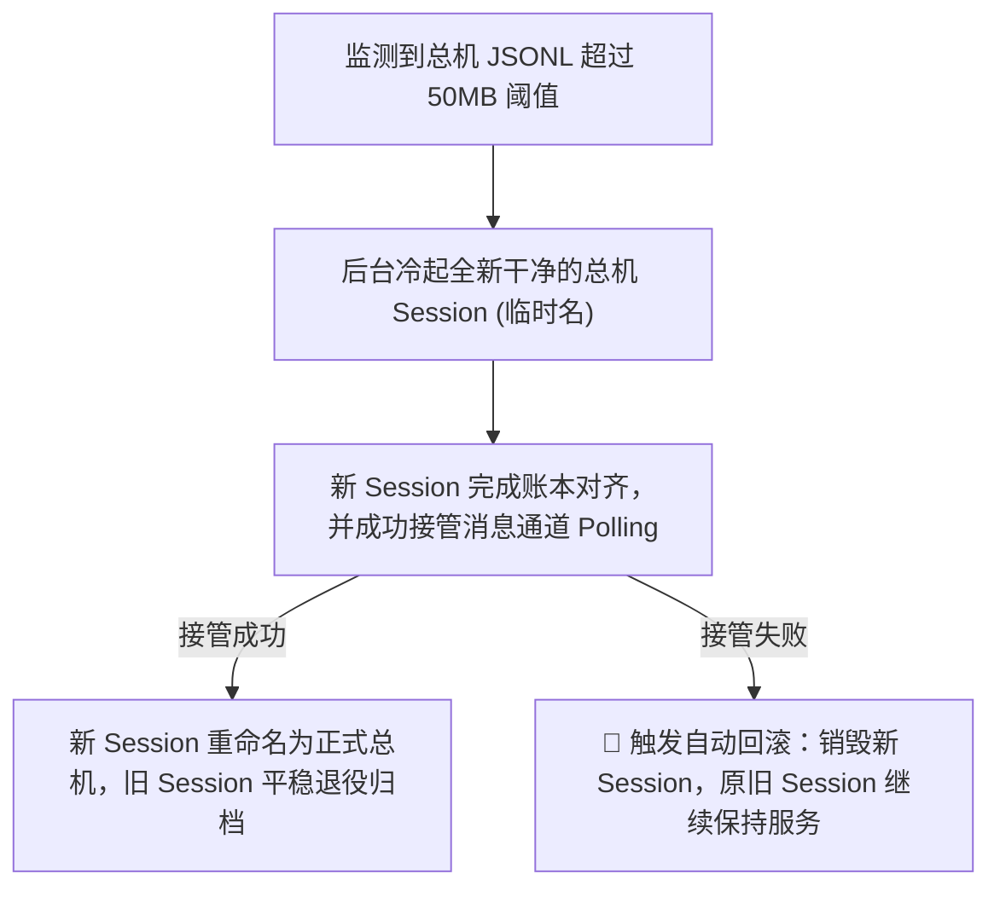

# 第三部分 · 核心治理架构与自愈拓扑 (Governance Architecture)

---

## 1. 三层分层治理契约（L1 / L2 / L3 Tiering）

为了防止多项目之间规则混乱，系统实行严格的分层治理：

---

## 2. 多模型运行时解耦（Multi-Runtime Core Decoupling）

系统严禁在核心逻辑中写死特定 Agent 名字：

- **Core 规范**：事务账本、状态流转、Git 同步、安全拦截只按**能力标准（Capabilities）**与标准 I/O 运行；
- **Runtime Adapter**：Claude Code、Codex CLI、Gemini CLI 仅作为最外层适配器，用于映射各自的命令行参数与 Session 路径；
- **收益**：模型随时可热插拔切换，整个系统的治理语义和安全防线保持绝对恒定。

---

## 3. 双机对等 Canonical 架构（Dual-Canonical Topology）

对于拥有两台及以上工作站（如台式机 + 笔记本）的高级用户：

- **Git Bare 扇出**：主干仓库配置对等 bare 镜像；
- **Post-receive 秒级事件钩子**：一端 push，对端 2 秒内自动触发 fetch 和合并；
- **自愈冲突解决器**：自动识别由自动生成物引发的伪冲突，确保双端无感平滑协同。

---

## 4. 移动总机模式与 50MB 原子换壳自愈（Switchboard & Fail-Closed Auto-Rotation）

1. **接线不干重活**：总机接收语音/文本意图后，仅生成轻量任务卡并分派给对应子项目的临时 Worker 执行；Worker 完成即销毁，总机 Context 增长极慢；
2. **50MB 阈值监控**：守护进程精确监控总机转录文件大小；
3. **Fail-Closed 切换防线**：新会话握手成功后才平滑切流；若启动失败立即自动回滚，消息通道 100% 永不中断。
